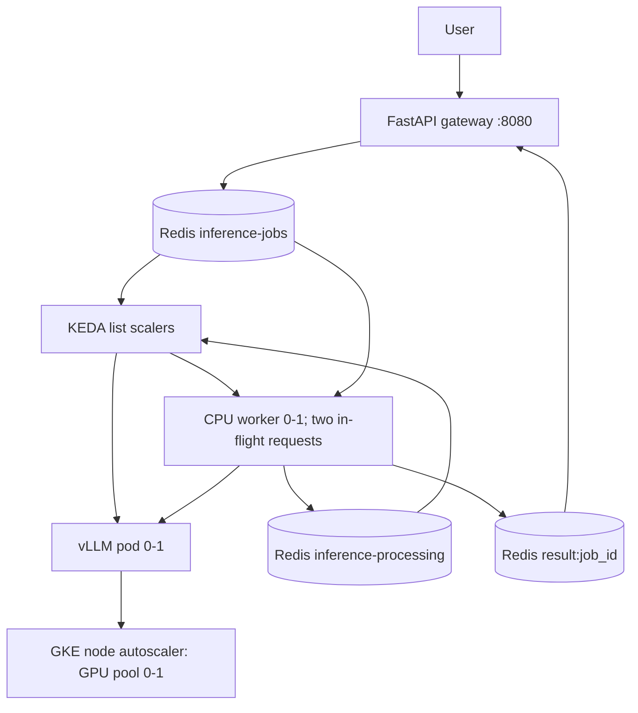

# KEDA Scale-to-Zero GPU Inference

An asynchronous inference example: the gateway accepts a prompt and returns a job ID, Redis buffers it, a CPU worker sends it to vLLM, and the result can be polled. KEDA watches both queued and in-flight jobs to scale the worker and GPU-backed vLLM Deployment from zero. A **separately configured** Kubernetes node autoscaler must provision and retire GPU nodes. This repository has not been benchmarked on GKE; timings and cost estimates from other projects are not measurements of this implementation.

Maintainers: [project architecture and verification rules](CLAUDE.md).



The worker atomically moves a job into `inference-processing` before inference. On restart it requeues unfinished jobs, and both KEDA ScaledObjects watch that list so a stranded job wakes the worker and vLLM again. Result storage and acknowledgment share a Redis transaction. Processing is **at least once**: a crash after inference can repeat a completion. Redis AOF and a PVC reduce, but do not eliminate, storage loss. The gateway is internal-only; do not expose it publicly without authentication, TLS and rate limits.

## Local API Mode

Requires Python 3.12+, Docker with a running daemon, and a reachable OpenAI-compatible `/v1/completions` endpoint. A macOS laptop without an NVIDIA GPU cannot run the provided vLLM GPU Deployment locally. Local mode runs the worker continuously; it does not exercise Kubernetes autoscaling.

```bash
uv venv --python 3.12 .venv
uv pip install --python .venv/bin/python -r requirements.txt
docker run -d --name inference-redis -p 6379:6379 redis:7.4 --appendonly yes
.venv/bin/uvicorn gateway:app --host 127.0.0.1 --port 8080
```

In a second terminal, run the worker with a reachable inference endpoint:

```bash
REDIS_URL=redis://localhost:6379 VLLM_URL=http://localhost:8000/v1/completions .venv/bin/python worker/worker.py
```

In a third terminal:

```bash
.venv/bin/python producer.py
curl http://localhost:8080/result/JOB_ID
.venv/bin/python load_test.py --requests 10 --concurrency 5 --timeout 1200
```

`POST /generate` accepts `{"prompt":"Explain autoscaling","max_tokens":80}` and returns HTTP 202 with `{"job_id":"..."}`. `GET /result/{job_id}` returns `pending`, `done` with `response`, or `error` with `error`; unknown or expired IDs return 404. Completed results expire after 300 seconds; the submission marker expires after one hour. `GET /health` checks Redis connectivity. An unavailable vLLM endpoint is retried for up to 15 minutes to accommodate GPU cold starts.

## Kubernetes / GKE

The `k8s/` base assumes an existing GPU-capable cluster with a default dynamic StorageClass, NVIDIA GPU drivers/device plugin, and KEDA installed. Its Kustomize entry point creates the **`llm-inference` namespace**, a persistent Redis pod, gateway, CPU worker, GPU vLLM pod, Redis exporter, two PVCs, and two ScaledObjects. The CPU control plane, Redis, and persistent disks remain billed while GPU nodes are at zero. The model cache PVC is populated by vLLM on first start; it survives pod and node churn, but the first run still downloads the weights. Keep GPU nodes and zonal volumes in a compatible zone.

For a GKE example, first verify GPU quota, regional availability, cluster costs, storage provisioning, and permission to create Spot nodes. Use a CPU pool for KEDA, Redis and the gateway, plus an autoscaled T4 pool with minimum size zero:

The guarded deployment script builds an image in Artifact Registry, creates or reuses a zonal cluster and 0-1 Spot T4 node pool, installs KEDA and applies the manifests. It does **not** run automatically or include monitoring. Review the exact project, zone, quota, IAM and cost before running it:

```bash
PROJECT_ID=YOUR_PROJECT CONFIRM_BILLING=yes bash scripts/deploy-gke.sh
kubectl port-forward -n llm-inference service/gateway 8080:8080
```

The manual equivalent (and useful troubleshooting path) is:

```bash
gcloud container clusters create inference-demo --zone us-east1-d --machine-type e2-standard-4 --num-nodes 1
gcloud container node-pools create gpu-pool --cluster inference-demo --zone us-east1-d \
	--machine-type n1-standard-4 --accelerator type=nvidia-tesla-t4,count=1,gpu-driver-version=default \
	--spot --enable-autoscaling --min-nodes 0 --max-nodes 1 --num-nodes 0
gcloud container clusters get-credentials inference-demo --zone us-east1-d
helm repo add kedacore https://kedacore.github.io/charts
helm repo update
helm upgrade --install keda kedacore/keda --namespace keda --create-namespace
kubectl create namespace llm-inference
```

Check `kubectl get nodes -o json` for `nvidia.com/gpu` allocatable when a GPU node is present. The vLLM pod requests one GPU and tolerates the common GKE GPU taint; adjust machine sizing, tolerations and storage class for other clusters. Kubernetes manifests do **not** create node pools, GPU drivers, or the node autoscaler.

To compare cold starts without including the first model download, seed the PVC once while the GPU Deployment is at zero. This optional CPU Job uses the same `HF_HOME=/models` mount as vLLM:

```bash
kubectl apply -n llm-inference -f k8s-cloud/gcp/model-cache-seed.yaml
kubectl wait -n llm-inference --for=condition=complete job/model-cache-seed --timeout=20m
```

The Job needs network access to Hugging Face and a writable 10 Gi volume. If it fails, inspect `kubectl logs -n llm-inference job/model-cache-seed`; do not begin a cold-start comparison until it succeeds. You can omit the Job to include the download in the initial cold-start measurement.

Build and publish two application images, replace the gateway and worker image placeholders in their respective Deployments with accessible tags, then apply. The guarded GKE script above does this automatically with Artifact Registry:

```bash
docker build -t ghcr.io/YOUR_ORG/scale-zero-gateway:YOUR_TAG .
docker build -t ghcr.io/YOUR_ORG/scale-zero-worker:YOUR_TAG worker/
docker push ghcr.io/YOUR_ORG/scale-zero-gateway:YOUR_TAG
docker push ghcr.io/YOUR_ORG/scale-zero-worker:YOUR_TAG
kubectl apply -k k8s/
kubectl set image -n llm-inference deployment/gateway gateway=ghcr.io/YOUR_ORG/scale-zero-gateway:YOUR_TAG
kubectl set image -n llm-inference deployment/inference-worker worker=ghcr.io/YOUR_ORG/scale-zero-worker:YOUR_TAG
kubectl rollout status -n llm-inference deployment/redis
kubectl rollout status -n llm-inference deployment/gateway
kubectl port-forward -n llm-inference service/gateway 8080:8080
```

The example is limited to one CPU worker and one vLLM pod because the shared processing-list recovery assumes one worker replica. The worker overlaps two requests so vLLM can batch them; scaling to two worker pods would require per-worker recovery ownership or a consumer-group queue. The KEDA queue length of 5 is an HPA scaling target, not a minimum activation threshold: one queued request still wakes the system. The processing-list trigger stays at 1 to keep an in-flight job active. `maxReplicaCount: 1` remains intentional, not a capacity benchmark. The gateway does not impose queue-depth limits, so add admission controls before exposing it to untrusted traffic.

The gateway and worker have separate Docker build contexts and dependencies. The gateway image starts Uvicorn; the worker image starts `python -u worker.py` so queue and inference logs are unbuffered.

## Exercise the Scale Cycle

In another terminal, while port-forwarding:

```bash
.venv/bin/python load_test.py --gateway http://localhost:8080 --requests 10 --concurrency 5 --timeout 1200
kubectl get pods -n llm-inference -w
kubectl get nodes -w
kubectl get scaledobjects -n llm-inference
kubectl get events -n llm-inference --sort-by=.lastTimestamp
```

Watch for KEDA activation, the pending GPU pod, node provisioning, vLLM readiness, results, the 300-second KEDA cooldown, and eventual node removal. Load-test output reports completed, errored, timed-out and mean/max end-to-end durations; it does not claim to measure token throughput or time to first token. Spot eviction can cause a job to run again after restart; inspect `kubectl logs -n llm-inference deployment/inference-worker` and Redis list lengths when debugging.

For a timestamped cold/warm/cooldown run, leave the gateway port-forward active and start at zero worker and vLLM replicas **and** zero GPU nodes:

```bash
bash scripts/full-cycle-run.sh http://localhost:8080
```

The script writes namespace events, pod and node watch output, worker and vLLM log streams, 15-second queue depth and replica samples, two load summaries and a timestamped timeline under `data/run-*/` (ignored by Git). It marks vLLM readiness and node-count changes and pauses for 60 seconds between the cold and warm phases. `GPU_POOL` selects the GKE pool label (default `gpu-pool`); `PAUSE_SECONDS` controls the pause and `TIMEOUT_SECONDS` bounds the scale-down wait (default 2400). It exits nonzero if the cluster is not initially at zero, any job fails, or it never returns to zero. Log streaming depends on pods starting successfully; inspect Kubernetes events if a log file is empty. The script does not provision or tear down cloud resources. Avoid concurrent deployments or other workloads on the GPU pool during the measurement.

## Metrics And Cold Starts

The Redis exporter exposes queue key sizes on port 9121; vLLM exposes its built-in Prometheus endpoint on port 8000. The gateway exposes `/metrics` on port 8080; the worker serves `/metrics` on port 9100 when scaled above zero. With the Prometheus Operator installed, an example kube-prometheus-stack configuration is provided:

```bash
helm repo add prometheus-community https://prometheus-community.github.io/helm-charts
helm repo update
helm upgrade --install monitoring prometheus-community/kube-prometheus-stack \
	--namespace monitoring --create-namespace -f monitoring/prometheus-values.yaml
kubectl -n monitoring create configmap inference-dashboard \
	--from-file=monitoring/dashboard.json --dry-run=client -o yaml | kubectl apply -f -
kubectl -n monitoring label configmap inference-dashboard grafana_dashboard=1 --overwrite
kubectl port-forward -n monitoring service/monitoring-grafana 3000:80
```

The 17-panel dashboard shows Redis waiting/in-flight jobs, pod replicas, allocatable GPUs, GPU utilization/power/memory/temperature, vLLM completions and token rates, p95 time to first token, accepted prompts, HTTP errors, inference outcomes, p95 queue-to-stored-result latency, and scrape health. It selects the chart's Prometheus datasource at runtime. `gateway_http_requests_total` labels route templates and status codes, not individual job IDs; HTTP 4xx/5xx are distinct from `inference_jobs_total{status="error"}`. `inference_job_duration_seconds` is observed only after Redis stores and acknowledges a result. Its clock starts at gateway admission, so it includes queueing and model startup; vLLM TTFT measures a different interval. Older jobs without an admission timestamp have no end-to-end histogram observation. Redis queue metrics use fixed-key lookups, so a nonexistent queue key may be absent between runs; the dashboard renders it as zero. kube-state-metrics comes from kube-prometheus-stack. In the scrape-health panel, `worker` and `vllm` targets at zero are expected when those pods have scaled to zero; gateway and Redis targets should remain up.

The four GPU panels require DCGM data in **this chart's Prometheus datasource**. Newer GKE clusters may already provide [GKE-managed DCGM collection](https://docs.cloud.google.com/kubernetes-engine/docs/how-to/dcgm-metrics) in Cloud Monitoring. Check that first; do not install another exporter on top of it, since duplicate collection can produce incorrect metrics. To use the GKE-managed data, configure Grafana with a datasource that can query Cloud Monitoring instead of the local Prometheus datasource used by this example.

Only if managed DCGM is **not** enabled, and after reviewing the chart's GPU access and host privileges, opt in to the [NVIDIA DCGM Exporter Helm chart](https://docs.nvidia.com/datacenter/dcgm/latest/installation/install-dcgm-exporter.html#install-with-helm):

```bash
helm repo add gpu-helm-charts https://nvidia.github.io/dcgm-exporter/helm-charts
helm repo update
helm upgrade --install dcgm-exporter gpu-helm-charts/dcgm-exporter \
	--namespace gpu-monitoring --create-namespace -f monitoring/dcgm-values.yaml
kubectl get pods -n gpu-monitoring -l app.kubernetes.io/name=dcgm-exporter
```

The values constrain exporter pods to T4 GPU nodes and disable its ServiceMonitor; `monitoring/prometheus-values.yaml` discovers those pods on port 9400 instead. When the GPU pool is zero, the exporter also has zero pods and the four GPU panels have no data. After a GPU node appears, verify the exporter endpoint contains `DCGM_FI_DEV_GPU_UTIL`, `DCGM_FI_DEV_POWER_USAGE`, `DCGM_FI_DEV_FB_USED` and `DCGM_FI_DEV_GPU_TEMP`, then check Prometheus target health. No GPU exporter or dashboard data was tested on a live cluster here. The example chart retains metrics for 24 hours in ephemeral storage; use durable remote storage for long-running monitoring. Dashboard panels are configuration, not a measured screenshot or event annotation.

The model PVC avoids downloading weights after the first successful start, but the large vLLM image must still be pulled on a new GPU node. For an **optional** image-cache comparison, follow [Google's Secondary Boot Disk guide](https://docs.cloud.google.com/kubernetes-engine/docs/how-to/data-container-image-preloading) to build a disk image containing the exact `vllm/vllm-openai:v0.10.2` image. The official builder needs a log bucket, Compute Engine API, compatible COS/GKE version, disk-image permissions and a sized disk. Building the image incurs charges and is not automated here. Once the image exists in the same GCP project, attach it to a dedicated 0-1 GPU pool:

```bash
PROJECT_ID=YOUR_PROJECT DISK_IMAGE=your-vllm-cache CONFIRM_BILLING=yes bash scripts/deploy-gke.sh
GPU_POOL=gpu-cache-your-vllm-cache bash scripts/full-cycle-run.sh http://localhost:8080
```

The opt-in path enables image streaming (required for the secondary-disk plugin), creates an image-specific GPU pool with `CONTAINER_IMAGE_CACHE` mode, and pins vLLM to that pool. It does not prove the cache was used: check GKE's `gcfs-snapshotter` logs for a secondary-disk cache hit and compare the vLLM pod's `Pulled` events before and after. Rebuild a **new disk image and pool** when the vLLM image version changes. Keep the model PVC and request load constant across uncached and cached runs; record queue-to-ready, node provision, image pull and model load separately before claiming gains. A GPU node at zero does not make the CPU node, control plane, monitoring or disks free.

For the disposable cluster created above, remove it after the experiment (including its node pools); check for any retained volumes or external monitoring resources that still incur charges:

```bash
PROJECT_ID=YOUR_PROJECT CONFIRM_DELETE=inference-demo bash scripts/destroy-gke.sh
```

Deleting the cluster does not remove the Artifact Registry image repository or any separately installed monitoring/storage resources. Review those explicitly in your cloud account.

## Tests

```bash
uv pip install --python .venv/bin/python 'httpx>=0.27,<1'
PYTHONPATH=. .venv/bin/python -m unittest discover -s tests -v
```
